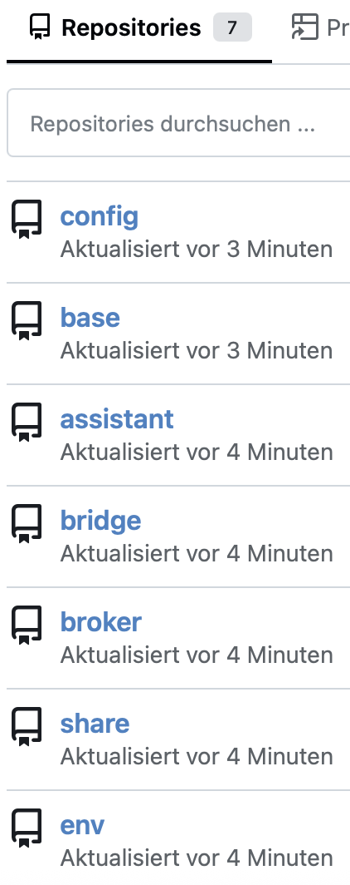

# Proxmox GitOps Container Automation

## Overview

Proxmox GitOps implements a self-contained, extensible CI/CD environment for provisioning, configuring, and orchestrating Linux Containers (LXC) within Proxmox VE. Leveraging an Infrastructure-as-Code (IaC) approach, it manages the entire container lifecycle—bootstrapping, deployment, configuration, and verification—through version-controlled automation.

The system follows a multi-stage pipeline capable of recursively deploying and configuring itself. Initial bootstrapping is performed via a local Docker environment, with subsequent deployments targeting Proxmox VE. This approach ensures consistent, reproducible, and automated infrastructure management.

## Architecture

The architecture is based on a self-replicating pipeline that bootstraps from Docker and deploys to Proxmox VE.

  

## Usage

The system is based on **automation**: Components are deployed recursively as containers in a new environment and, in turn, within Proxmox VE. Docker serves as the base container for development and bootstraps the recursive pipeline.

- Configure **credentials and Proxmox API token** in [`local/.config.json`](local/.config.json) as `config.json`
- Run `local/run.sh` for Docker
- Accept the [`Pull Request`](http://localhost:8080/srv/proxmoxgitops/pulls/1) to deploy on Proxmox VE

### Requirements

- Docker
- Proxmox VE
- Proxmox API token
- see [Wiki](https://github.com/stevius10/Proxmox-GitOps/wiki) for recommendations 

### Core Concepts

#### Self-Replication
- During configuration, the codebase is pushed into a Gitea instance running inside the container
- This triggers the same pipeline from within the new environment, enabling recursive configuration ("pipeline within a pipeline")
- Subsequent runs are idempotent: Ansible and Chef validate and enforce the desired state using static configuration

#### Key Features

- **Self-Managed Infrastructure:** The system provisions, configures, and verifies itself recursively
- **Container Provisioning:** Managed by Ansible using the Proxmox API for container lifecycle management
- **Container Configuration:** Managed by cookbooks for application-level setup
- **CI/CD Orchestration:** Execution is handled by a Runner automatically installed inside the container
- **Environment Management:** Environment variables are initially loaded from `config.json` and recursively propagated into the GitOps system
- **Modularity:** Distinct components and modular reusable workflows managed within Gitea, facilitating extension
- **Network Share:** Configured for integration purposes

### Pipeline Workflow

  

Stages include:

- **`base` Job**
  - Triggered on `release` branch pushes
  - Uses a composite action (`srv/base/.gitea/workflows@main`) to check out the provisioning repository and run Ansible for container setup

- **`config` (and `share`) Jobs**
  - Copy project files into the container and execute Chef/Cinc in local mode to configure the system