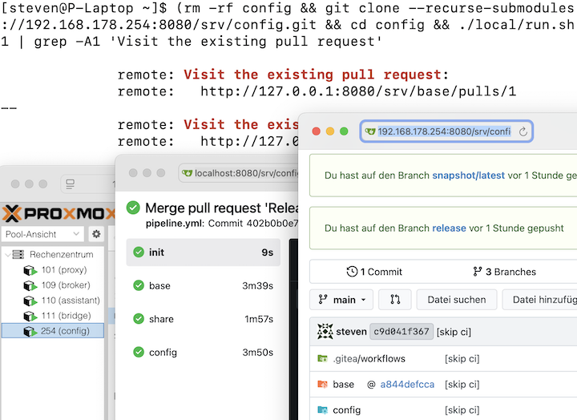
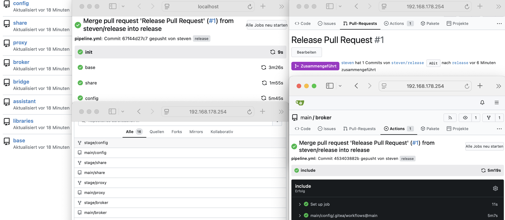
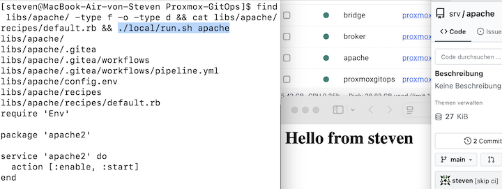

[](https://github.com/stevius10/Proxmox-GitOps/actions/workflows/build.yml) [](https://opensource.org/licenses/MIT)

[](https://www.proxmox.com/) [](https://www.proxmox.com/)


## Table of Contents
- [Overview](#overview)
- [Architecture](#architecture)
  - [Core Concepts](#core-concepts)
  - [Design](#design)
  - [Trade-offs](#trade-offs)
- [Usage](#usage)
  - [Lifecycle](#lifecycle)
    - [Self-contained Monorepository](#self-contained-monorepository)
  - [Requirements](#requirements)
  - [Getting Started](#getting-started)
    - [Development and Container Extension](#development-and-container-extension)

---

## Overview

Proxmox-GitOps implements a self-sufficient, extensible CI/CD environment for provisioning, configuring, and orchestrating Linux Containers (LXC) within Proxmox VE. Leveraging an Infrastructure-as-Code (IaC) approach, it manages the entire container lifecycle—bootstrapping, deployment, configuration, and validation—through version-controlled automation.

## Architecture

The architecture is based on a multi-stage pipeline capable of recursively deploying and configuring itself as a self-managed control plane. 

<p align="center">
  
</p>

Initial bootstrapping is performed via a local Docker environment, with subsequent deployments targeting Proxmox VE.  

### Core Concepts 

This system implements stateless infrastructure management on Proxmox VE, ensuring deterministic reproducibility and environmental parity through recursive self-containment.

| Concept | Approach | Reasoning |
|---------|----------|-----------|
| **Ephemeral State** | Git repository represents *current desired state*, ensuring state purity across deployments.| Deployment consistency and stateless infrastructure over version history. |
| **Recursive Self-Containment** | Embedded control plane recursively provisions itself within target containers, ensuring deterministic bootstrap.| Prevents configuration drift; enables consistent and reproducible behavior. |
| **Dynamic Orchestration** | Imperative logic (e.g. `config/recipes/repo.rb`) used for dynamic, cross-layer state management| Declarative approach intractable for adjusting to dynamic cross-layer changes (e.g. submodule remote rewriting). |
| **Monorepository** | Centralizes infrastructure as a single code artifact; submodules modularize development at runtime | Consistency and modularity: infrastructure self-contained; dynamically resolved in recursive context. |

### Design

- **Loosely coupled**: Containers are decoupled from the control plane, enabling runtime replacement and independent operation. 

- **Headless container configuration:** By convention, Ansible is used for provisioning (`community.proxmox` upstream); Cinc (Chef) handles modular, recursive desired state complexity. 

<p align="center">
  
</p>

### Trade-offs

- **Complexity vs. Autonomy:** Recursive self-replication increases complexity drastically to achieve integrated deterministic bootstrap and reproducing behavior.

- **Git Convention vs. Infrastructure State:** Uses Git as a state engine rather than versioning in volatile, stateless contexts. Monorepository representation, however, encapsulates the entire infrastructure as a self-contained asset suited for version control.

- **API Token Restriction vs. Automation:** With Proxmox 9, stricter privilege separation prevents privileged containers from mounting shares via API token; automation capabilities, however, are mainly within the root user context. As a consequence, root user-based API access takes precedence over token-based authentication.

## Usage

### Lifecycle

#### Self-contained Monorepository

- `git clone --recurse-submodules` 
  - e. g., **Version-Controlled Mirrored**

- **Backup**: See [Self-contained Monorepository](#self-contained-monorepository)
  - store /share for persistence, disable network access for security

- **Update**: See [Self-contained Monorepository](#self-contained-monorepository), and redeploy merged

- **Rollback**: See [Self-contained Monorepository](#self-contained-monorepository), or set `snapshot` branch to `release` at runtime

### Requirements

- Docker
- Proxmox VE 8.4-9.0
- See [Wiki](https://github.com/stevius10/Proxmox-GitOps/wiki) for recommendations

### Getting Started

- Set **Proxmox** and **global usage credentials** in [`local/.config.json`](local/.config.json) as `./local/config.json`
- Ensure **container configuration** in [`config.env`](config.env) and verify storage
- Run `./local/run.sh` for local Docker environment
- Accept the Pull Request at `localhost:8080/main/config/pulls/1` to deploy on Proxmox VE

<p align="center">
  
</p>

#### Development and Container Extension

Reusable container definitions are stored in the [`libs`](libs) folder. 

Copy an example container (like [`libs/broker`](libs/broker) or [`libs/proxy`](libs/proxy)) as a template, or create a new container lib from scratch and follow these steps:

- Add `config.env` to your container's root directory (e.g. `./libs/apache`):
```dotenv
IP=192.168.178.42
ID=42
HOSTNAME=apache
CORES=2
MEMORY=2048
SWAP=512
DISK=local-lvm:8
BOOT=yes
```

- Add your cookbook to the container definition root:
```ruby
# libs/apache/recipes/default.rb
package 'apache2'

file '/var/www/html/index.html' do
  content "<h1>Hello from #{Env.get(node, 'login')}</h1>"
  mode '0644'
  owner 'app'    # see base/roles/base/tasks/main.yml
  group 'config' # each container is configured identically 
end

Common.application(self, 'apache2') # provided by convention
```

- Optionally, use `Env.get()` and `Env.set()` to access Gitea environment variables.

- Add to Monorepository and redeploy.

The container can be tested locally running `./local/run.sh [container]` (_wip_)

<p align="center">
  
</p>
