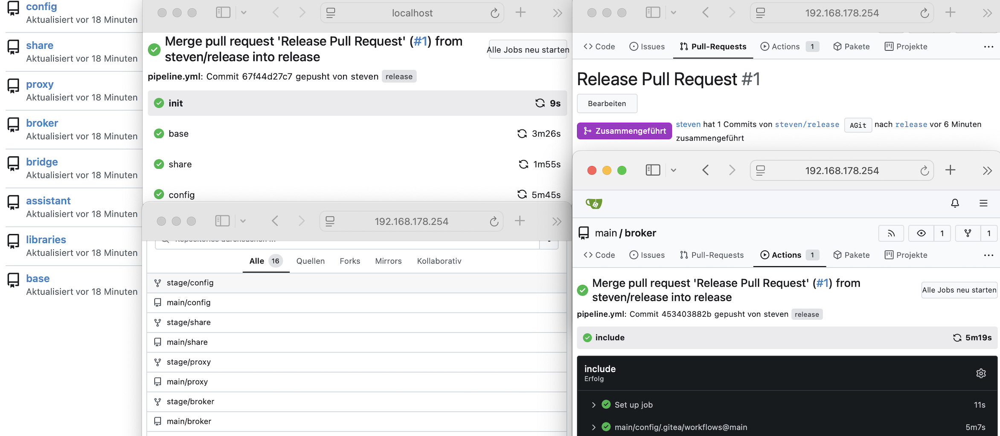
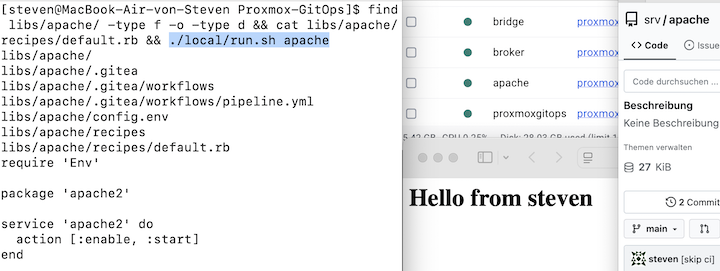
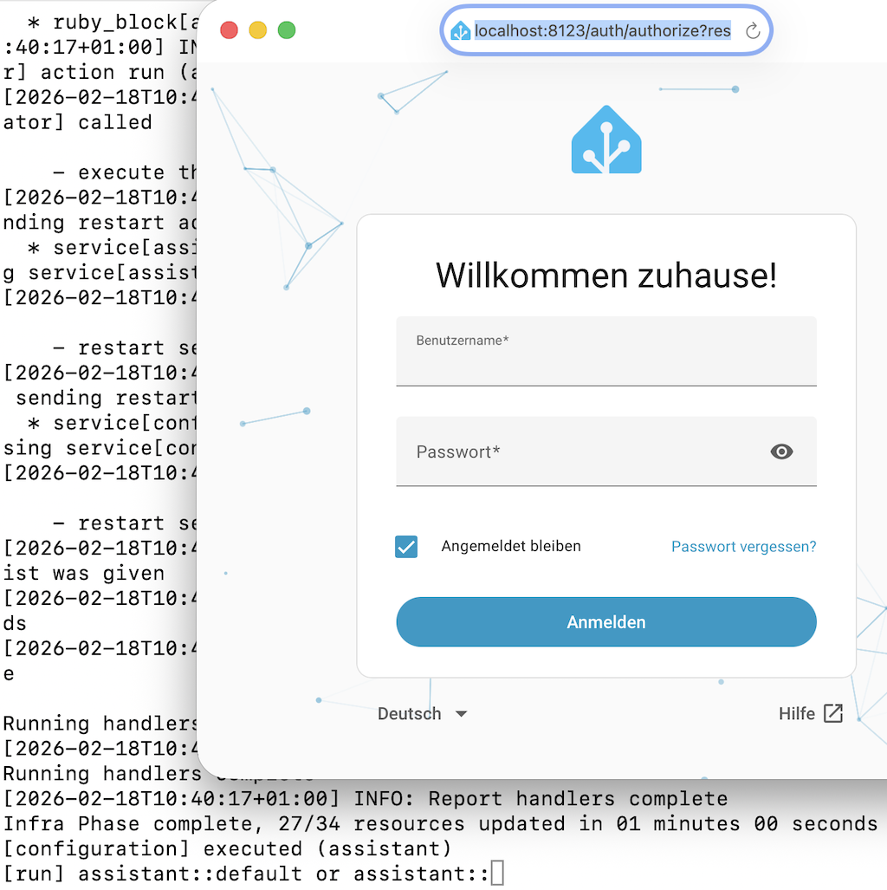

[](https://github.com/stevius10/Proxmox-GitOps/actions/workflows/build.yml) [](https://github.com/stevius10/Proxmox-GitOps/actions/workflows/build.yml)

[](https://www.proxmox.com/) [](https://www.proxmox.com/) [](https://opensource.org/licenses/MIT)

## Table of Contents
- [Overview](#overview)
- [Architecture](#architecture)
  - [Core Concepts](#core-concepts)
  - [Design](#design)
  - [Trade-offs](#trade-offs)
- [Usage](#usage)
  - [Requirements](#requirements)
  - [Deployment](#deployment)
  - [Files and Configuration](#files-and-configuration)
  - [Lifecycle](#lifecycle)
    - [Default Pipeline](#default-pipeline)
    - [Self-Containment](#self-containment)
  - [Development and Extension](#development-and-extension)
    - [Getting Started](#getting-started)
    - [Environment](#environment)

---

## Overview

Proxmox-GitOps implements a self-contained GitOps environment for provisioning and orchestrating Linux Containers (LXC) on Proxmox VE.

Encapsulating infrastructure within an extensible monorepository - recursively resolved from Git submodules at runtime - it provides a comprehensive Infrastructure-as-Code (IaC) abstraction for an entire, automated container-based infrastructure.

<p align="center"><br>
  <a href="docs/demo.gif" target="_blank" rel="noopener noreferrer">
    
  </a>
</p><br>

## Architecture

The architecture is based on a multi-stage pipeline capable of recursively deploying and configuring itself as a self-managed control plane.

<p align="center">
  <a href="docs/concept.svg" target="_blank" rel="noopener noreferrer">
    
  </a>
</p>

Initial bootstrapping is performed via a local Docker environment, with subsequent deployments targeting Proxmox VE.  

### Core Concepts

Proxmox-GitOps standardizes stateless infrastructure and automates container-based deployment on Proxmox VE. 

| Concept | Approach | Reasoning |
|:---|:---|:---|
| **Desired State**         | Monorepository as Single Source of Truth represents the entire infrastructure state. | Deterministic bootstrap from code over version history. |
| **Self-Containment**      | The composite monorepository is pushed to a local container, triggering a pipeline that provisions onto Proxmox. | Fully automated infrastructure deployment mirroring local development. |
| **Dynamic Configuration** | Imperative logic (e.g. `config/recipes/repo.rb`) used for dynamic, cross-layer state management. | Declarative approach intractable for dynamic cross-layer changes (e.g. submodule remote rewriting). |
| **Monorepository**        | Centralizes infrastructure as a single code artifact, utilizing submodules for modular composition. | Provides modular container base; dynamically resolved for container-specific workflow control. |

### Design

- **Decoupled Architecture:** Containers operate independently, allowing for runtime replacement and detached operation.

- **Headless container configuration:** By convention, Ansible is used for provisioning (`community.proxmox` upstream); Cinc (Chef) handles modular, recursive desired state complexity.

- **Integrated Baseline:** The `base` role standardizes container configuration defaults. *Proxmox-GitOps* leverages this baseline and built-in infrastructure libraries to deploy itself, establishing a reproducible operational pattern to reuse for container `libs`.

### Trade-offs

- **Complexity vs. Autonomy:** Self-containment increases complexity to achieve automated bootstrap and reproducible behavior.

- **Git as State Engine:** Uses Git as a state engine rather than for versioning in volatile, stateless contexts. Monorepository representation, however, encapsulates the entire infrastructure as a self-contained asset suited for version control.

- **API Token Restriction vs. Automation:** With Proxmox 9, stricter privilege separation prevents privileged containers from mounting shares via API token; automation capabilities, however, are mainly within the root user context. As a consequence, root user-based API access takes precedence over token-based authentication.

## Usage

### Requirements

- Docker
- Proxmox VE 8.4-9.1
- See [Wiki](https://github.com/stevius10/Proxmox-GitOps/wiki) for recommendations

### Deployment

- Set **Proxmox VE host** and **default account** [credentials](https://github.com/stevius10/Proxmox-GitOps/wiki/Example-Configuration#configuration-file) in [`local/config.json`](local/config.json).

- Adjust **environment configuration** in [`globals.json`](globals.json).

- Ensure **container configuration** in [`container.env`](container.env). 

- Run `./local/run.sh` for local Docker environment.

- Accept the Pull Request at `http://localhost:8080/main/config` to deploy on Proxmox VE. 

<p align="center"><br>
  <a href="docs/img/nutshell.png" target="_blank" rel="noopener noreferrer">
    
  </a>
</p><br>

### Files and Configuration

The configuration logic uses cascading overrides to separate infrastructure defaults. 

- Global environment variables can be set in [`globals.json`](globals.json).

- `container.stage.env` is sourced for forked-repository deployments.

- `.local` files can be used to [structure versioning](.gitignore); e.g. `globals.local.json`, `container.local.env` or [`10-assistant.local.caddy`](libs/proxy/files/default/config/10-assistant.caddy)

- See **[Configuration Reference](docs/reference/configuration.md)**.

### Lifecycle

#### Default Pipeline
  - run `release`: creates and configures a container. 
  - run `main`: configures an existing container. 
  - run `snapshot`: creates a snapshot leveraging [`Utils.snapshot`](https://github.com/stevius10/Proxmox-GitOps/blob/develop/config/libraries/utils.rb).
  - run `rollback`: rolls back configuration changes.

#### Self-Containment

`git clone --recurse-submodules`, e.g., for **Version-Controlled Mirroring**.

- `local/share/` can be used for [persistence](https://github.com/stevius10/Proxmox-GitOps/wiki/State-and-Persistence).

- Backup, Update and Rollback: See [Self-Containment](#self-containment), which mirrors the system's architecture, implying lifecycle operations emerge from the principle itself.

### Development and Extension

Reusable container definitions are stored in the [`libs`](libs) folder. 

#### Getting Started

Copy an example container (like [`libs/broker`](libs/broker) or [`libs/proxy`](libs/proxy)) as a template, or create a new container lib from scratch and follow these steps:

- Add `container.env` to your container's root directory (e.g. `./libs/apache`):
```dotenv
IP=192.168.178.42
ID=42
CORES=2
MEMORY=2048
SWAP=512
DISK=local-lvm:8
BOOT=yes
```

- Add your cookbook to the container definition root:

```ruby
# libs/apache/recipes/default.rb
package 'apache2'

file '/var/www/html/index.html' do
  content "<h1>Hello from #{Env.get(node, 'login')}</h1>"
  mode '0644'
  owner Default.user(self)  # see base/roles/base/tasks/main.yml
  group Default.group(self) # each container is configured identically 
end

Common.application(self, 'apache2') # provided by convention
```

- Add to Monorepository and redeploy.

  <details>
  <summary>Getting Started: ./run.sh apache</summary>
  <br>
  <p align="center">
    <a href="docs/img/development.png">
      
    </a>
  </p> <br>
  </details><br>

- Container [`libs`](libs/) can be tested locally by running `./local/run.sh [container]`:

  <details>
  <summary>Example: ./run.sh assistant -p 8123</summary>
  <br>
  <p align="center">
    <a href="docs/img/local.png">
      
    </a>
  </p> <br>
  </details>

#### Environment

- Optionally, use [`Env.get()` and `Env.set()`](config/libraries/env.rb) to access environment variables, initially set by [globals](globals.json).
