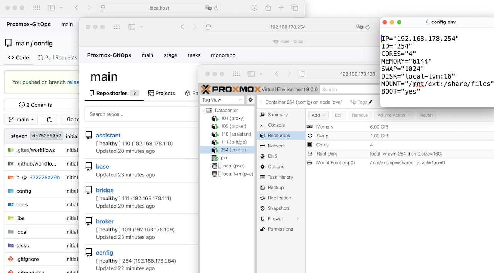
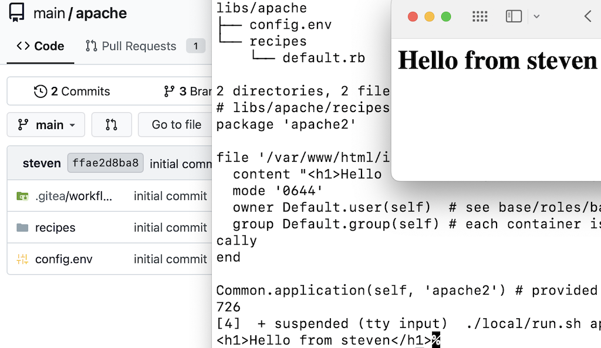

[](https://github.com/stevius10/Proxmox-GitOps/actions/workflows/build.yml) [](https://github.com/stevius10/Proxmox-GitOps/actions/workflows/build.yml)

[](https://www.proxmox.com/) [](https://www.proxmox.com/) [](https://opensource.org/licenses/MIT)

## Table of Contents
- [Overview](#overview)
- [Architecture](#architecture)
  - [Core Concepts](#core-concepts)
  - [Design](#design)
  - [Trade-offs](#trade-offs)
- [Usage](#usage)
  - [Requirements](#requirements)
  - [Deployment](#deployment)
  - [Lifecycle](#lifecycle)
  - [Files and Configuration](#files-and-configuration)
  - [Development and Extension](#development-and-extension)
    - [Getting Started](#getting-started)
    - [Environment](#environment)

---

## Overview

Proxmox-GitOps implements a self-contained GitOps environment for provisioning and orchestrating Linux Containers (LXC) on Proxmox VE.

Encapsulating infrastructure within an extensible monorepository - recursively resolved from Git submodules at runtime - it provides a comprehensive Infrastructure-as-Code (IaC) abstraction for an entire, automated container-based infrastructure.

<p align="center"><br>
  <a href="docs/demo.gif" target="_blank" rel="noopener noreferrer">
    
  </a>
</p><br>

## Architecture

The architecture is based on a multi-stage pipeline capable of recursively deploying and configuring itself as a self-managed control plane.

<p align="center">
  <a href="docs/concept.svg" target="_blank" rel="noopener noreferrer">
    
  </a>
</p>

Initial bootstrapping is performed via a local Docker environment, with subsequent deployments targeting Proxmox VE.  

### Core Concepts 

This system implements stateless infrastructure management on Proxmox VE, ensuring deterministic reproducibility and environmental parity through recursive self-containment.

| Concept | Approach | Reasoning |
|---------|----------|-----------|
| **Ephemeral State** | Git repository represents *current desired state*, ensuring state purity across deployments.| Deployment consistency and stateless infrastructure over version history. |
| **Recursive Self-Containment** | Control plane seeds itself by pushing its monorepository onto a locally bootstrapped instance, triggering a pipeline that recursively provisions the control plane onto PVE.| Environmental parity for local and PVE, enabling one-click deployment from version-controlled monorepository. Reuse of validated, generic base. 
| **Dynamic Orchestration** | Imperative logic (e.g. `config/recipes/repo.rb`) used for dynamic, cross-layer state management.| Declarative approach intractable for adjusting to dynamic cross-layer changes (e.g. submodule remote rewriting). |
| **Monorepository** | Centralizes infrastructure as single code artifact, using submodules for modular composition.| Consistency and modularity: infrastructure self-contained; dynamically resolved in recursive context. |

### Design

- **Loosely coupled**: Containers are decoupled from the control plane, enabling runtime replacement and independent operation. 

- **Headless container configuration:** By convention, Ansible is used for provisioning (`community.proxmox` upstream); Cinc (Chef) handles modular, recursive desired state complexity.

- **Integrated Baseline:** The `base` role standardizes defaults in container configuration. The control plane leverages this baseline and uses built-in infrastructure libraries to deploy itself recursively, establishing an operational pattern that is reproduced in container `libs`.

<p align="center"><br>
  <a href="docs/img/staging.png" target="_blank" rel="noopener noreferrer">
    
  </a>
</p><br>

### Trade-offs

- **Complexity vs. Autonomy:** Recursive self-replication increases complexity drastically to achieve integrated deterministic bootstrap and reproducing behavior.

- **Git Convention vs. Infrastructure State:** Uses Git as a state engine rather than versioning in volatile, stateless contexts. Monorepository representation, however, encapsulates the entire infrastructure as a self-contained asset suited for version control.

- **API Token Restriction vs. Automation:** With Proxmox 9, stricter privilege separation prevents privileged containers from mounting shares via API token; automation capabilities, however, are mainly within the root user context. As a consequence, root user-based API access takes precedence over token-based authentication.

## Usage

### Requirements

- Docker
- Proxmox VE 8.4-9.1
- See [Wiki](https://github.com/stevius10/Proxmox-GitOps/wiki) for recommendations

### Deployment

- [Set](https://github.com/stevius10/Proxmox-GitOps/wiki/Example-Configuration#configuration-file) **Proxmox VE host** and **default account** credentials in [`local/config.json`](local/config.json). 

- Ensure **container configuration** in [`container.env`](container.env) and [verify storage](https://github.com/stevius10/Proxmox-GitOps/wiki/Example-Configuration#file-configenv). 

- Run `./local/run.sh` for local Docker environment. 

- Accept the Pull Request at `localhost:8080/main/config` to deploy on Proxmox VE. 

<p align="center"><br>
  <a href="docs/img/nutshell.png" target="_blank" rel="noopener noreferrer">
    
  </a>
</p><br>

### Lifecycle

#### Self-Containment

`git clone --recurse-submodules`, e.g. for **Version-Controlled Mirroring**

- **Deployment**
  - `release`: container deployment
  - `main`: container configuration

- **Backup**: See [Self-Containment](#self-containment)
  - `snapshot`: [`Utils.snapshot`](https://github.com/stevius10/Proxmox-GitOps/blob/develop/config/libraries/utils.rb)
  - use `local/share/` for [persistence](https://github.com/stevius10/Proxmox-GitOps/wiki/State-and-Persistence) or self-reference network share. 

- **Update**: See [Self-Containment](#self-containment), and redeploy merged. 

- **Rollback**: See [Self-Containment](#self-containment), or push `rollback` to `release` at runtime. 

*Appendix*: The self-referential language in this section is intentional. It mirrors the system's recursive architecture, implying lifecycle operations emerge from the principle itself.

### Files and Configuration

- Global environment variables can be set in [`env.json`](env.json)

- `.local.` files can be used to structure versioning, e. g. `env.local.json`, `container.local.json` or `libs/proxy/../10-assistant.local.caddy`

- Staging configuration `container.stage.env` is sourced for forked repository deployments

### Development and Extension

Reusable container definitions are stored in the [`libs`](libs) folder. 

#### Getting Started

Copy an example container (like [`libs/broker`](libs/broker) or [`libs/proxy`](libs/proxy)) as a template, or create a new container lib from scratch and follow these steps:

- Add `container.env` to your container's root directory (e.g. `./libs/apache`):
```dotenv
IP=192.168.178.42
ID=42
CORES=2
MEMORY=2048
SWAP=512
DISK=local-lvm:8
BOOT=yes
```

- Add your cookbook to the container definition root:

```ruby
# libs/apache/recipes/default.rb
package 'apache2'

file '/var/www/html/index.html' do
  content "<h1>Hello from #{Env.get(node, 'login')}</h1>"
  mode '0644'
  owner Default.user(self)  # see base/roles/base/tasks/main.yml
  group Default.group(self) # each container is configured identically 
end

Common.application(self, 'apache2') # provided by convention
```

- Add to Monorepository and redeploy.

#### Environment

- Optionally, use `Env.get()` and `Env.set()` to access Gitea environment variables.

<p align="center"><br>
  <a href="docs/img/environment.png" target="_blank" rel="noopener noreferrer">
    
  </a>
</p><br>

- The container can be tested locally running `./local/run.sh [container]`:

  <details>
  <summary>Example: Apache</summary>
  <br>
  <p align="center">
    <a href="docs/img/development.png">
      
    </a>
  </p> <br>
  </details>
